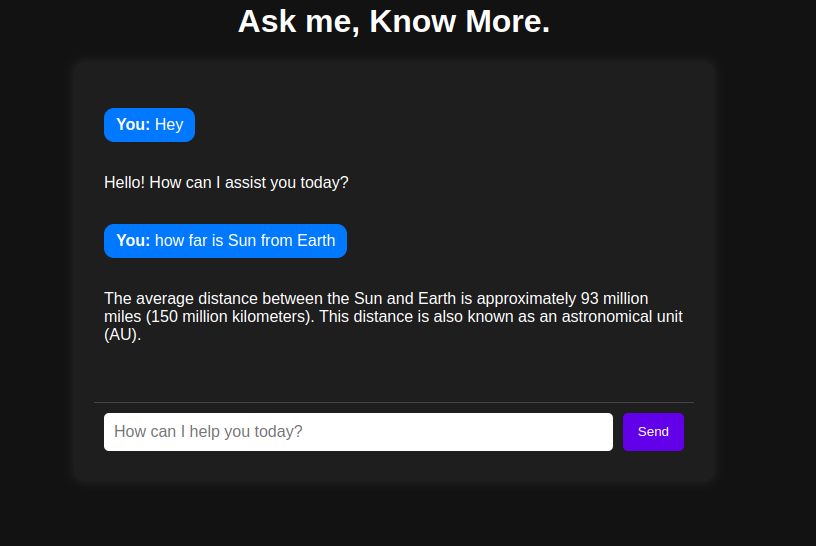

# Simple Ai chat bot

This project is a simple AI-powered chatbot using FastAPI for the backend and HTML, CSS, and JavaScript for the frontend. The chatbot interacts with an AI model via API requests and displays responses dynamically.
    

## Backend:
    Python
    FastAPI
    Requests
    Pydantic
    dotenv (for environment variables)

# Frontend:
    HTML
    CSS
    JavaScript

# Installation & Setup

## Clone the repository
git clone https://github.com/ai-chat-bot.git

cd ai-chat-bot

# Create a virtual environment:
    python -m venv venv
    source venv/bin/activate   # For Linux/macOS
    venv\Scripts\activate   
# Install dependencies
     pip install -r requirements.txt

# run server 
    uvicorn server:app --reload

# API Endpoint
       POST /chat
           request 
       
           {
              "message": "Hello, AI!"
           }
           
           Response
           
           {
              "reply": "Hello! How can I assist you today?"
           }
           
